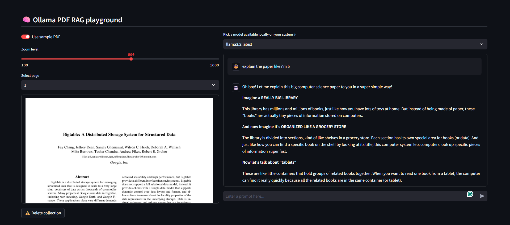

# PDF RAG with Ollama

A Streamlit-based application that allows you to chat with PDF documents using Retrieval-Augmented Generation (RAG) powered by Ollama local language models.

## Screenshot

*Screenshot showing the PDF RAG application interface with document upload and chat functionality*